# Capstone-Project---Azure-Machine-Learning-Engineer

## Overview
This project is part of the Udacity Azure ML Nanodegree.
We create Two models: one using Automated ML (denoted as AutoML ) and one customized model whose hyperparameters are tuned using HyperDrive and compare the performance of both the models and deploy the best performing model.

  

## Project Set Up and Installation

Visual Studio code.

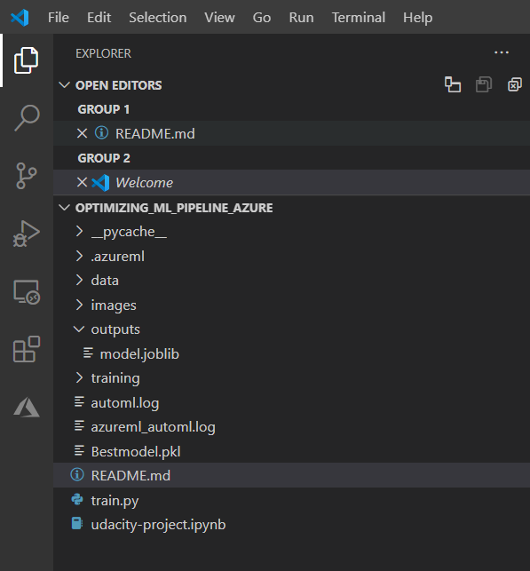

Azure Visual Studio code Plugins

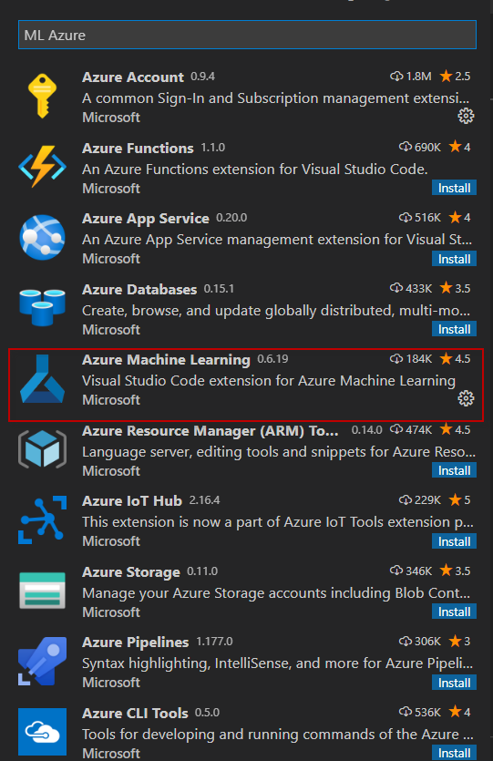  

Azure Visual Studio code - Jupyter and python.

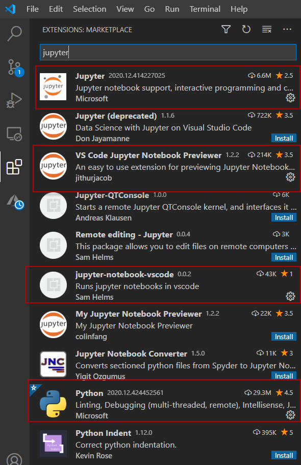  

## Azure Libraries.
pip install azureml-sdk
pip install azureml-core

## Dataset

### Overview

Data set used for this project https://www.kaggle.com/blastchar/telco-customer-churn  (https://raw.githubusercontent.com/nandex7/Capstone-Project---Azure-Machine-Learning-Engineer/main/data/WA_Fn-UseC_-Telco-Customer-Churn.csv) contains the information of Customers who left within the last month – the column is called Churn

Services that each customer has signed up for – phone, multiple lines, internet, online security, online backup, device protection, tech support, and streaming TV and movies

Customer account information how long they’ve been a customer, contract, payment method, paperless billing, monthly charges, and total charges
Demographic info about customers – gender, age range, and if they have partners and dependents

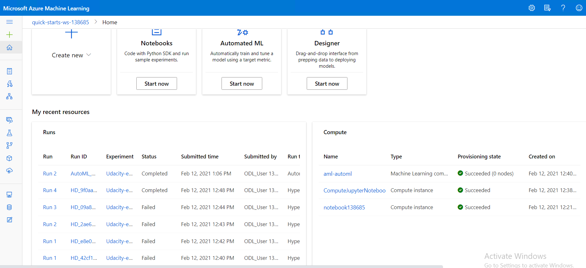

## Details of Columns.

customerID =Customer ID

gender = Whether the customer is a male or a female

SeniorCitizen = Whether the customer is a senior citizen or not (1, 0)

Partner = Whether the customer has a partner or not (Yes, No)

Dependents =Whether the customer has dependents or not (Yes, No)

tenure = Number of months the customer has stayed with the company

PhoneService =Whether the customer has a phone service or not (Yes, No)

MultipleLines = Whether the customer has multiple lines or not (Yes, No, No phone service)

InternetService =Customer’s internet service provider (DSL, Fiber optic, No)

OnlineSecurity = Whether the customer has online security or not (Yes, No, No internet service)

### Task
We use the data for prediction whether a person has left the company (Churn or no Churn) a binary Classification model.

We need first use the configurated file for the Authentication. Login first to ml.azure.com and We need to download the configuration file.
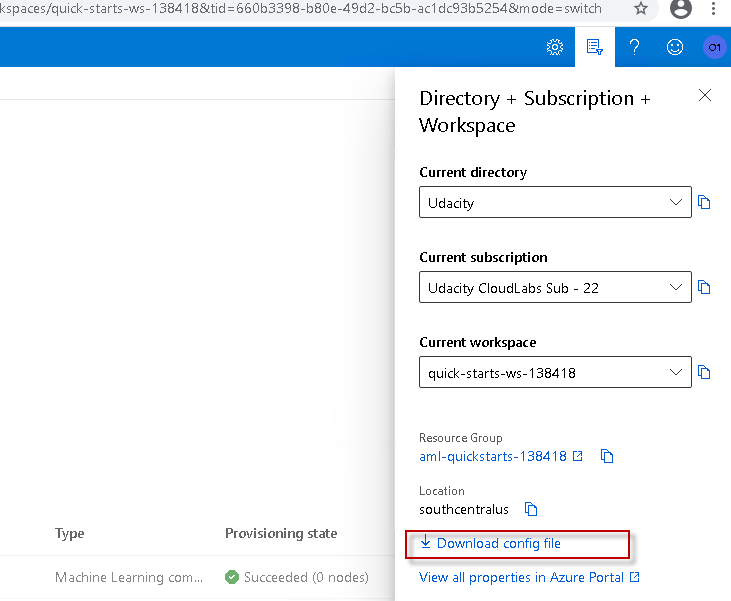

We need to create a Compute Resource and create the  AutoML Configuration , deploy the best model and register and publish the best model and test the model. 

We will be using all the variables and we will make some cleaning information ,hot encoding of category variables and change boolean columns to 1 or 0  for the Hyperparameters option.

 

### Access

We load the information to the workspace in azure for the automl using the url provided in the requeriments in udacity platform. 

    if key in ws.datasets.keys(): 
            found = True
            dataset = ws.datasets[key] 

    if not found:
            # Create AML Dataset and register it into Workspace
            example_data = 'https://archive.ics.uci.edu/ml/machine-learning-databases/00519/heart_failure_clinical_records_dataset.csv'
            dataset = Dataset.Tabular.from_delimited_files(example_data)        
            #Register Dataset in Workspace
            dataset = dataset.register(workspace=ws,
                                   name=key,
                                   description=description_text)

    df = dataset.to_pandas_dataframe()
    df.describe()

We load the information using the url and Tabular Dataset Factory.

    from azureml.data.dataset_factory import TabularDatasetFactory

    factory = TabularDatasetFactory()
    test_data_path = "https://archive.ics.uci.edu/ml/machine-learning-databases/00519/heart_failure_clinical_records_dataset.csv"
    test_ds = factory.from_delimited_files(test_data_path)

## Automated ML

AutoMl.-
 We are using in the the project the option to run the AutoML model with the following configuration:
 
    automl_settings = {
           "experiment_timeout_minutes": 20,
            "max_concurrent_iterations": 4,
            "primary_metric" : 'accuracy',
            "n_cross_validations": 5,
            "featurization": 'auto'
}

    automl_config = AutoMLConfig(task = "classification",
                             training_data=dataset,
                             compute_target=compute_target,
                             label_column_name="Churn",   
                             debug_log = "automl_errors.log",
                             **automl_settings)

We are specifying in timeout of 20 minutes for the experiment and max_concurrent_iterations of 4 , based in getting the best accuracy ,and cross validations and also the option to get the right use of the data type in the case of Autml this it's very easy to manage it with feateurization auto and for the Hyper drive for example we made some cleaning like change categorization to hot encoding or change boolean values from Yes , No to 1  ,0 . 

We also use the task as Classification because in this case we want to predict a binary value , we specify the compute target that give us the resources environment for running the experiment , the Target column that is churn 1 or 0  and the log information debug_log.

### Results
As we can see in the result using AutoML that Voting Ensemble is the best Model 0.80932 and The other good result was with SparseNormalizer and lightGBM algorithm.

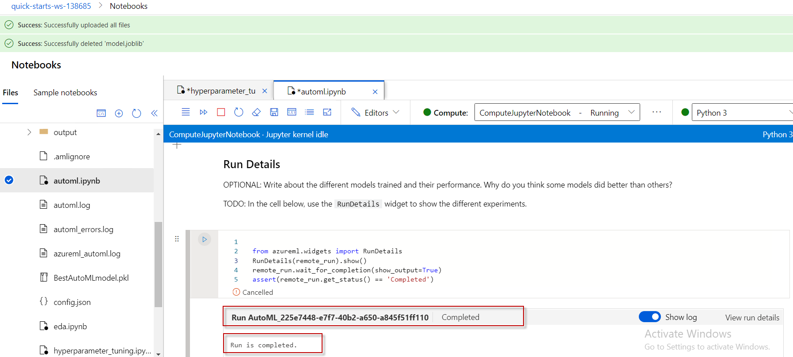
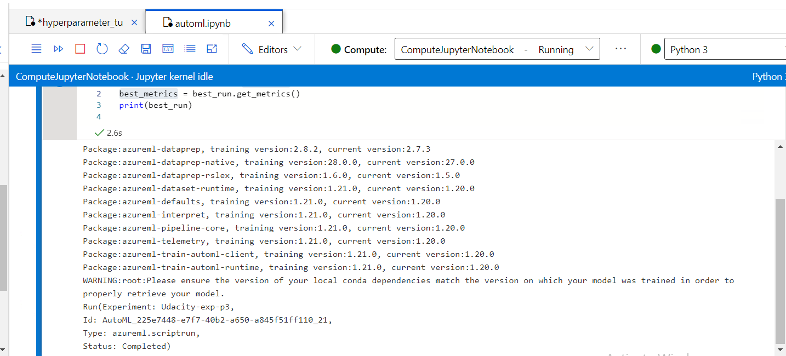
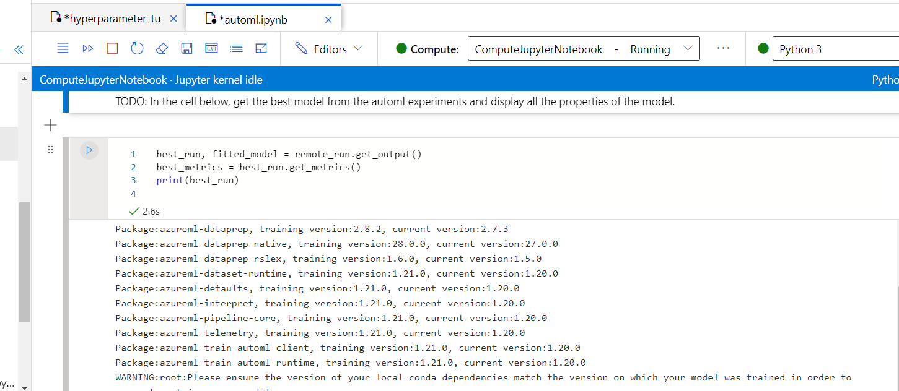
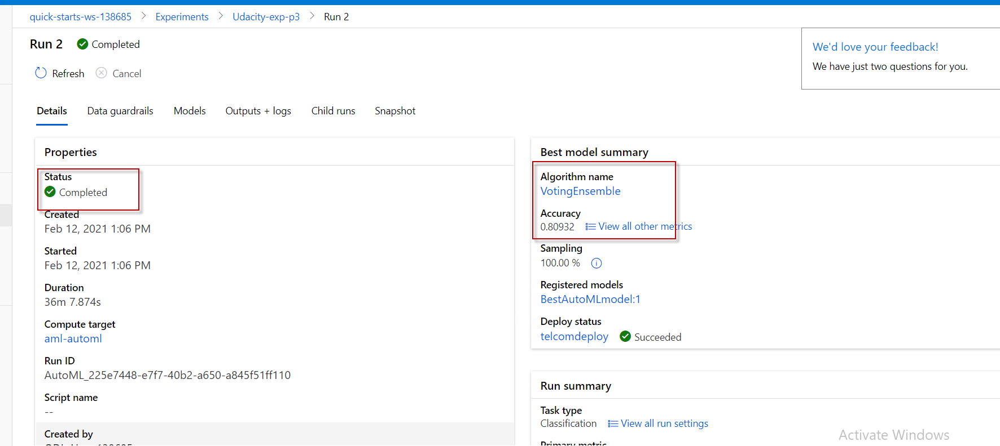
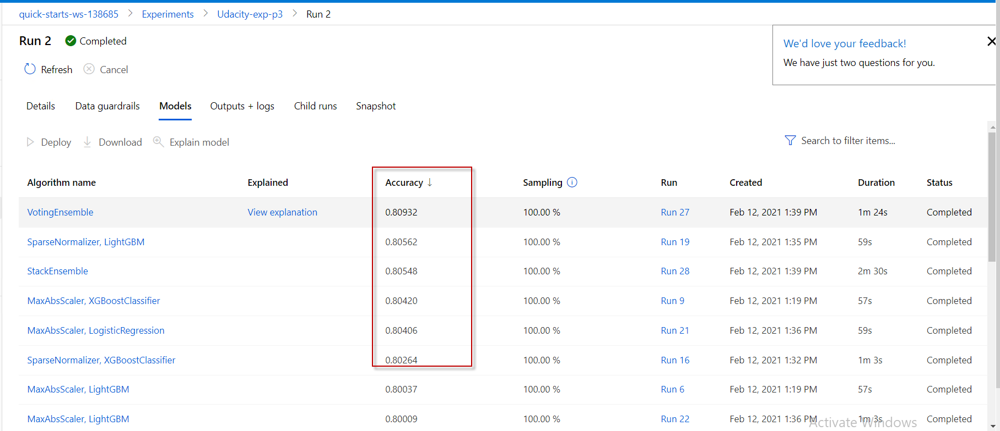

## Hyperparameter Tuning

First we configurate the Compute Target Cluster with a vm_size STANDARD_D2_V2 and max_nodes =4 . This give us the resources for creating the infraestructure to run the projects. We create a estimator Sklearn where the train.py is running. The train.py open and create the dataset and convert to data frame , clean the information where convert the categorical values to dummies, split in train test data and apply the logistic regression model.

We apply the hyperdriveconfig using RandomParameterSampling '--C':choice(0.01,0.05, 0.1, 0.5,1) and --max_iter':choice(5, 10, 20, 50, 100) This choice discrete values over a parameter search space. We also used a Banditpolicy with the following parameters
    
    ps = RandomParameterSampling({
		'--C':choice(0.01,0.05, 0.1, 0.5,1),
		'--max_iter':choice(5, 10, 20, 50, 100)
	}
    )

Evaluation_interval =2 the frequency for applying the policy

delay_evaluation = 0.1 delays the first policy evaluation for a specified number of intervals

Parameter sampler Random Sampling use random combinations of the hyperparameters to find best solution for the built model. Random Sampling Compared has better results over Grid Search method.

        policy = BanditPolicy(evaluation_interval=2
    ,slack_factor=0.1
    )

Stopping policy

Bandit Policy help us to stop based in the slack factor and evaluation interval . The policy early terminates any runs where the primary metric is not within the specified slack factor/slack amount with respect to the best performing training run , so we can avoid to spend much hardware resources.

We also we create a SKLearn estimator(Binary logistic Regression using train.py file  )We split for train an test the data and use this estimator in the hyperdrive configuation and we get the best model based in the parameters to check which is the best options hyperdrive vs automl.

### Results
*TODO*: What are the results you got with your model? What were the parameters of the model? How could you have improved it?

As you see in the results We got with Parameter sampling continuos -C() 0.05 and Max_iter 100 the best model and band policy evaluation internal 2 and delay_evaluation 0 , slack factor 0.1. We got 57m 32s of duration of the project .So 1 option is to add more continuos parameters to check over an improvement and to reduce time check over other compute target with more resources. We also can balance data and churn(target) to have better results

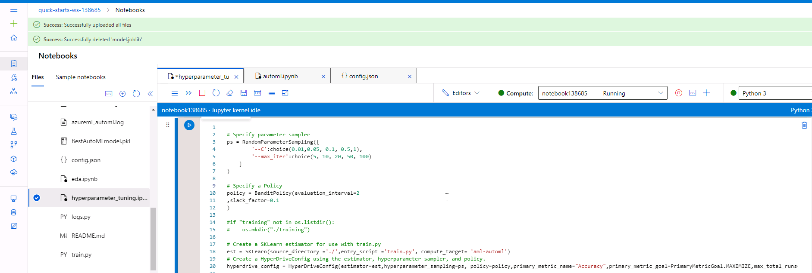
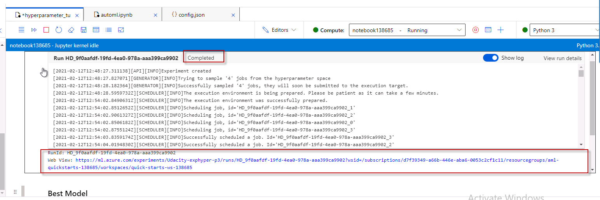
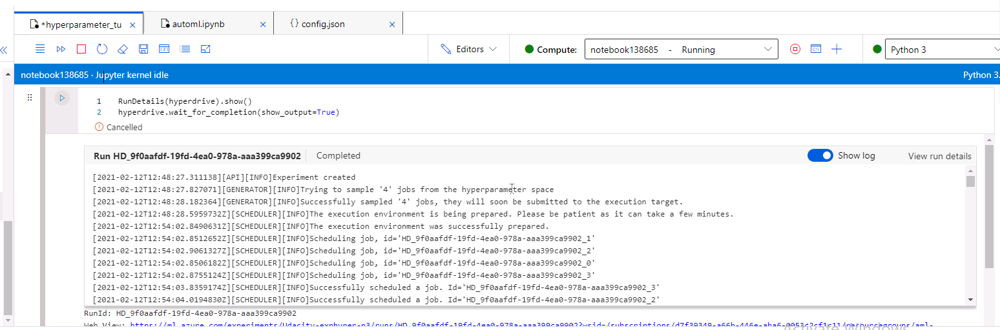
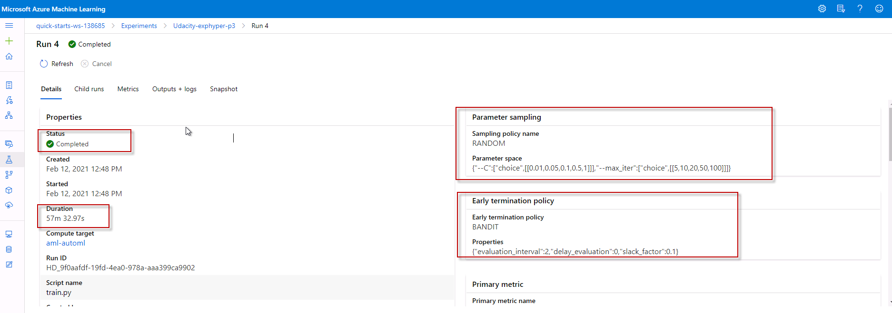
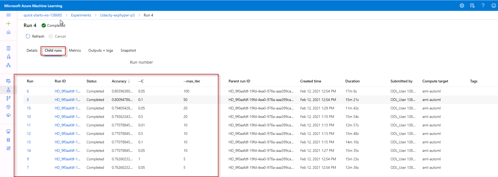
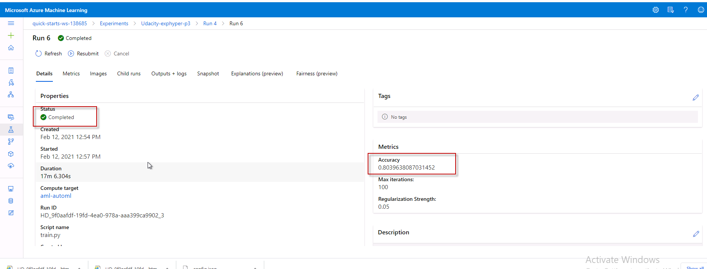
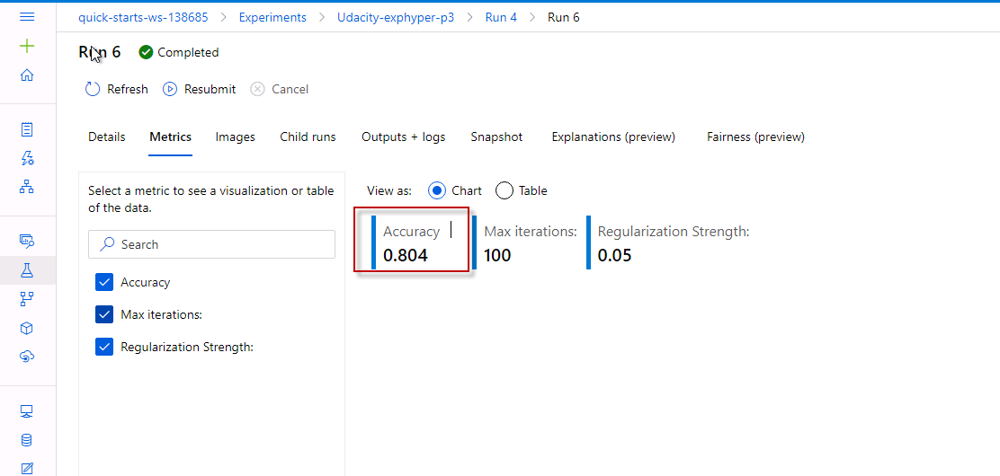

*TODO* Remeber to provide screenshots of the `RunDetails` widget as well as a screenshot of the best model trained with it's parameters.

## Model Deployment
*TODO*: Give an overview of the deployed model and instructions on how to query the endpoint with a sample input.

Compare the two models and their performance the performance using AutoML 0.80932 is slighly better than Hyperdrive 0.8039 but AutoML is faster than hyperdrive.

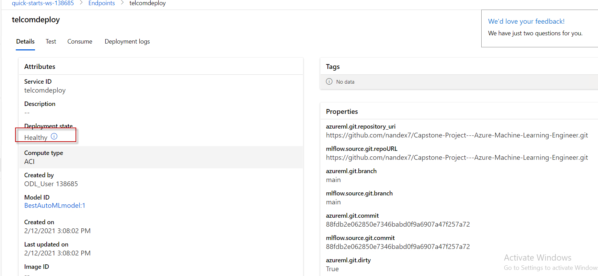
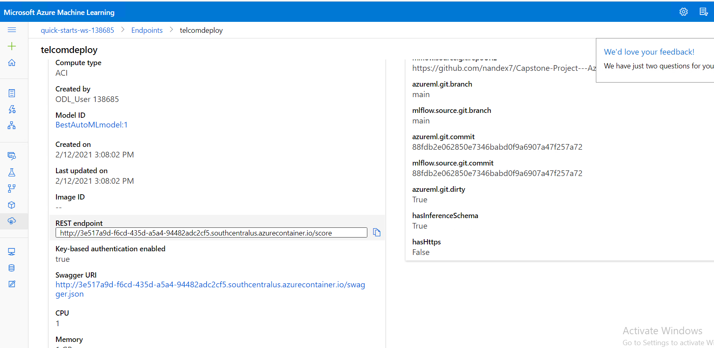
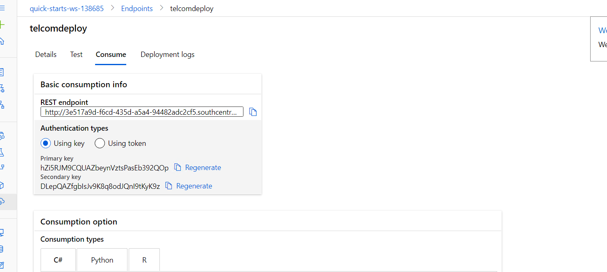

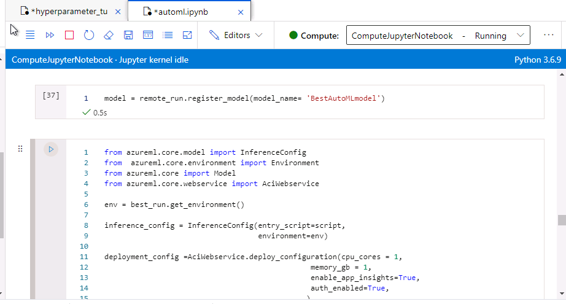

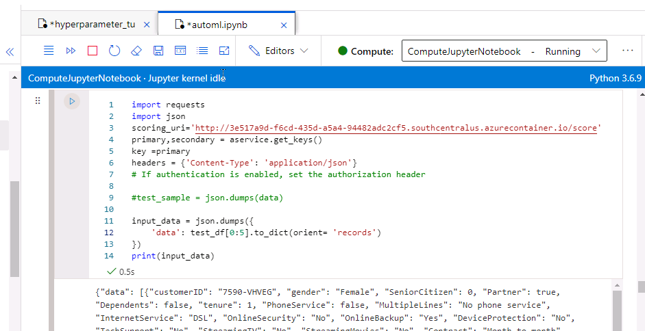

As you see in the testing endpoint we are using five customers to check if they are churn or not.

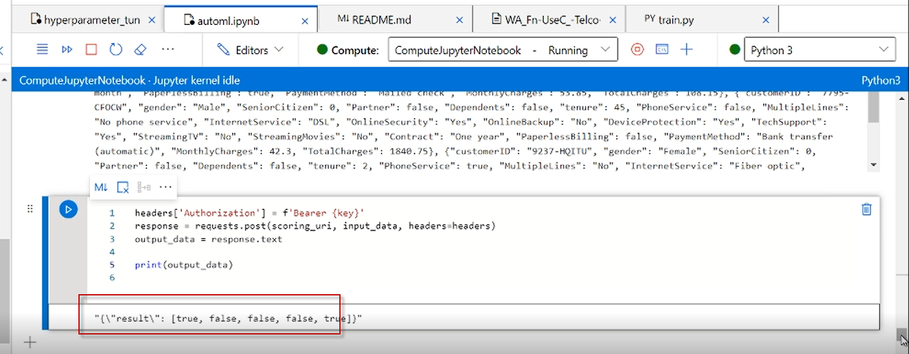

## Screen Recording

https://www.youtube.com/watch?v=IcwQETgHsUI&feature=youtu.be

## Standout Suggestions
We can add new parameters options to the hyper drive configuration.
Adding , testing new band policy interval and slack_factor.

Enable the option with Deeplearning in AutoML configuration could improve the accuracy of the model and GPU option trying other compute target.

Balancing the data is also an option to improve the accuracy of the models.

You can check more about imbalanced datasts machine learning.

https://towardsdatascience.com/handling-imbalanced-datasets-in-machine-learning-7a0e84220f28

https://machinelearningmastery.com/tactics-to-combat-imbalanced-classes-in-your-machine-learning-dataset/
